# Руководство Администратора

## Содержание

[Аннотация](#аннотация)

[Термины и определения](#термины-и-определения)

[Введение](#введение)

1. [Глава 1. Назначение](#глава-1-назначение)
   - [1.1. Общие сведения](#11-общие-сведения)
   - [1.2. Функциональные возможности](#12-функциональные-возможности)
   - [1.3. Область применения](#13-область-применения)
   - [1.4. Состав системы](#14-состав-системы)
2. [Глава 2. Требования к аппаратному обеспечению](#глава-2-требования-к-аппаратному-обеспечению)
   - [2.1. Сервер приложений](#21-сервер-приложений)
   - [2.2. Сервер баз данных](#22-сервер-баз-данных)
   - [2.3. Сетевая инфраструктура](#23-сетевая-инфраструктура)
3. [Глава 3. Подключение](#глава-3-подключение)
   - [3.1. Физическое подключение](#31-физическое-подключение)
   - [3.2. Сетевая конфигурация](#32-сетевая-конфигурация)
   - [3.3. Проверка подключения](#33-проверка-подключения)
4. [Глава 4. Разворачивание системы](#глава-4-разворачивание-системы)
   - [4.1. Подготовка среды](#41-подготовка-среды)
     - [4.1.1. Установка зависимостей](#411-установка-зависимостей)
     - [4.1.2. Настройка firewall](#412-настройка-firewall)
   - [4.2. Установка системы](#42-установка-системы)
   - [4.3. Инициализация базы данных](#43-инициализация-базы-данных)
   - [4.4. Настройка веб-сервера](#44-настройка-веб-сервера)
   - [4.5. Запуск системы](#45-запуск-системы)
   - [4.6. Проверка развертывания](#46-проверка-развертывания)
5. [Глава 5. Первоначальная настройка](#глава-5-первоначальная-настройка)
   - [5.1. Создание учетной записи администратора](#51-создание-учетной-записи-администратора)
   - [5.2. Настройка параметров системы](#52-настройка-параметров-системы)
   - [5.3. Настройка SSL/TLS](#53-настройка-ssltls)
   - [5.4. Настройка мониторинга](#54-настройка-мониторинга)
6. [Глава 6. Заведение ролей](#глава-6-заведение-ролей)
   - [6.1. Предопределенные роли системы](#61-предопределенные-роли-системы)
   - [6.2. Создание новой роли](#62-создание-новой-роли)
   - [6.3. Назначение роли пользователю](#63-назначение-роли-пользователю)
   - [6.4. Аудит ролей](#64-аудит-ролей)
7. [Глава 7. Техническое обслуживание](#глава-7-техническое-обслуживание)
   - [7.1. Техобслуживание аппаратного обеспечения](#71-техобслуживание-аппаратного-обеспечения)
     - [7.1.1. Регламент технического обслуживания](#711-регламент-технического-обслуживания)
     - [7.1.2. Мониторинг аппаратного обеспечения](#712-мониторинг-аппаратного-обеспечения)
     - [7.1.3. Действия при обнаружении неисправностей](#713-действия-при-обнаружении-неисправностей)
   - [7.2. Техобслуживание программного обеспечения](#72-техобслуживание-программного-обеспечения)
     - [7.2.1. Обновление системы](#721-обновление-системы)
     - [7.2.2. Управление логами](#722-управление-логами)
     - [7.2.3. Оптимизация производительности](#723-оптимизация-производительности)
     - [7.2.4. Мониторинг ПО](#724-мониторинг-по)
8. [Глава 8. Резервное копирование](#глава-8-резервное-копирование)
   - [8.1. Стратегия резервного копирования](#81-стратегия-резервного-копирования)
   - [8.2. Процедура резервного копирования](#82-процедура-резервного-копирования)
     - [8.2.1. Резервное копирование базы данных](#821-резервное-копирование-базы-данных)
     - [8.2.2. Резервное копирование файлов](#822-резервное-копирование-файлов)
   - [8.3. Расписание резервного копирования](#83-расписание-резервного-копирования)
   - [8.4. Настройка автоматического выполнения](#84-настройка-автоматического-выполнения)
   - [8.5. Проверка целостности резервных копий](#85-проверка-целостности-резервных-копий)
9. [Глава 9. Аварийное восстановление](#глава-9-аварийное-восстановление)
   - [9.1. Классификация инцидентов](#91-классификация-инцидентов)
   - [9.2. Процедура восстановления после сбоя](#92-процедура-восстановления-после-сбоя)
     - [9.2.1. Восстановление базы данных](#921-восстановление-базы-данных)
     - [9.2.2. Восстановление из полной резервной копии](#922-восстановление-из-полной-резервной-копии)
       - [9.3. Целевые показатели восстановления](#93-целевые-показатели-восстановления)
   - [9.4. План действий при аварийных ситуациях](#94-план-действий-при-аварийных-ситуациях)
     - [9.4.1. Отказ сервера приложений](#941-отказ-сервера-приложений)
     - [9.4.2. Отказ сервера баз данных](#942-отказ-сервера-баз-данных)
     - [9.4.3. Потеря данных](#943-потеря-данных)
   - [9.5. Тестирование процедуры восстановления](#95-тестирование-процедуры-восстановления)

[Приложение А. Журнал изменений](#приложение-а-журнал-изменений)

[Приложение Б. Схемы и диаграммы](#приложение-б-схемы-и-диаграммы)
---

## Аннотация

Настоящий документ является руководством администратора информационной системы и содержит полное описание процедур установки, настройки, эксплуатации и технического обслуживания системы. Документ предназначен для системных администраторов и инженеров технической поддержки, осуществляющих развертывание и сопровождение системы в промышленной среде.

**Цель документа:** обеспечить квалифицированный персонал пошаговыми инструкциями для эффективного управления системой, минимизации времени простоя и быстрого восстановления работоспособности в случае сбоев.

**Структура документа:** руководство охватывает полный жизненный цикл системы — от начальных требований к оборудованию до процедур аварийного восстановления. Каждый раздел содержит теоретические пояснения (зачем это нужно), практические инструкции (как выполнить) и конкретные примеры конфигураций.

**Объем документа:** ~40-50 страниц с учетом схем, таблиц и примеров кода.

---

## Термины и определения

*Таблица 1 — Термины и определения*

| Термин | Определение |
|--------|-------------|
| Администратор | Пользователь системы, обладающий правами на выполнение операций управления, настройки и обслуживания |
| Аппаратное обеспечение (АО) | Совокупность физических устройств, обеспечивающих функционирование системы (серверы, сетевое оборудование, системы хранения) |
| Программное обеспечение (ПО) | Совокупность программных компонентов, реализующих функциональность системы (ОС, СУБД, веб-сервер, приложение) |
| Резервная копия | Копия данных системы, созданная для возможности восстановления в случае утраты или повреждения оригинальных данных |
| Развертывание | Процесс установки и первоначальной конфигурации системы на целевом оборудовании |
| Роль | Набор прав и привилегий, определяющий возможности пользователя в системе |
| Техобслуживание | Комплекс мероприятий, направленных на поддержание системы в работоспособном состоянии |
| RTO | Recovery Time Objective — целевое время восстановления системы после сбоя |
| RPO | Recovery Point Objective — целевая точка восстановления, определяющая максимально допустимый объем потери данных |
| Сервер приложений | Программный компонент, отвечающий за обработку бизнес-логики и взаимодействие с пользователем |
| СУБД | Система управления базами данных (PostgreSQL) для хранения и обработки структурированной информации |
| Веб-сервер | Программный компонент (Nginx), обрабатывающий HTTP/HTTPS запросы пользователей |
## Введение

Настоящее «Руководство администратора [Название Информационной Системы]» разработано для [Название Организации] в соответствии с требованиями ГОСТ 2.105-95 «Единая система конструкторской документации. Общие требования к текстовым документам» и ГОСТ 19.505-79 «Руководство администратора. Требования к содержанию и оформлению».

**Цель данного раздела:** определить границы документа, его целевую аудиторию и общие принципы работы с ним. 

Документ описывает полный жизненный цикл администрирования [Название Информационной Системы]: от начальных требований к аппаратному обеспечению и процедур развертывания до регламентов технического обслуживания и аварийного восстановления. Руководство структурировано таким образом, чтобы администратор мог последовательно выполнить все необходимые операции по вводу системы в промышленную эксплуатацию и ее дальнейшему сопровождению. Каждый раздел содержит теоретическое обоснование (зачем это делается), практические инструкции (как это сделать) и конкретные примеры конфигураций.

Документ предназначен для использования специалистами (системными администраторами, инженерами технической поддержки), обладающими базовыми знаниями в области администрирования серверных систем, работы с ОС семейства Linux/Windows и сетевыми технологиями.

---

## Глава 1. Назначение

*Назначение раздела:* Данный раздел отвечает на вопросы «Что представляет собой система?» и «Какие бизнес-задачи она решает?». Он необходим для понимания администратором контекста работы системы и ее места в IT-инфраструктуре организации.

### 1.1. Общие сведения

[Название Информационной Системы] предназначена для автоматизации ключевых бизнес-процессов [Название Организации], включая централизованное управление данными, обработку запросов пользователей, формирование регламентированной отчетности и бесшовную интеграцию с внешними корпоративными системами.

### 1.2. Функциональные возможности

Система обеспечивает выполнение следующих функций:
- Управление пользователями и строгое разграничение прав доступа на основе ролевой модели (RBAC).
- Надежное хранение и быстрая обработка структурированных данных.
- Формирование аналитических материалов и отчетов в различных форматах.
- Интеграция с внешними информационными системами через защищенные API (REST/SOAP).
- Ведение детальных журналов событий и аудита действий пользователей для обеспечения информационной безопасности.
- Автоматизированное резервное копирование и гарантированное восстановление данных.

*Рисунок 1.1 — Контекстная диаграмма функциональных возможностей*
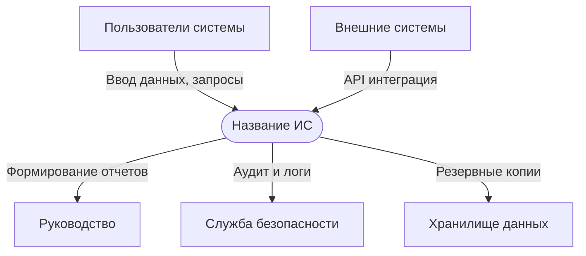

### 1.3. Область применения

Система применяется в корпоративной среде для обеспечения информационных процессов [Название Организации]. Архитектура системы позволяет развернуть ее как в локальной инфраструктуре заказчика (On-Premise), так и в защищенной облачной среде.

### 1.4. Состав системы

Система включает следующие программно-аппаратные компоненты:
- **Сервер приложений:** отвечает за исполнение бизнес-логики.
- **Сервер баз данных (СУБД):** обеспечивает надежное хранение данных.
- **Веб-сервер:** обрабатывает входящие HTTP/HTTPS запросы и обеспечивает балансировку.
- **Службы фоновой обработки задач:** выполняют асинхронные операции (рассылка, генерация отчетов).
- **Служба мониторинга и логирования:** собирает метрики производительности и события безопасности.

*Взаимосвязь компонентов представлена на Рисунке 1 (см. Приложение Б).*

---

## Глава 2. Требования к аппаратному обеспечению

*Назначение раздела:* Этот раздел отвечает на вопрос «Какое оборудование необходимо для стабильной работы?». Соблюдение рекомендуемых требований гарантирует отсутствие деградации производительности при росте числа пользователей и объема данных.
### 2.1. Сервер приложений

Сервер приложений выполняет основную вычислительную нагрузку по обработке бизнес-логики. 

*Таблица 2 — Требования к серверу приложений*

| Параметр | Минимальные требования (до 50 пользователей) | Рекомендуемые требования (до 200+ пользователей) |
|----------|---------------------------------------------|-------------------------------------------------|
| Процессор | 4 ядра, 2.0 ГГц | 8 ядер, 3.0 ГГц |
| Оперативная память | 8 ГБ | 16 ГБ |
| Дисковое пространство | 100 ГБ SSD | 500 ГБ SSD (RAID 1) |
| Сетевой интерфейс | 1 Гбит/с | 10 Гбит/с |
| Операционная система | Ubuntu 20.04 LTS / Windows Server 2019 | Ubuntu 22.04 LTS / Windows Server 2022 |

### 2.2. Сервер баз данных

СУБД является наиболее критичным к дисковым операциям и объему памяти компонентом. 

*Таблица 3 — Требования к серверу баз данных*

| Параметр | Минимальные требования | Рекомендуемые требования |
|----------|----------------------|-------------------------|
| Процессор | 4 ядра, 2.5 ГГц | 16 ядер, 3.5 ГГц |
| Оперативная память | 16 ГБ | 64 ГБ |
| Дисковое пространство | 500 ГБ SSD | 2 ТБ NVMe SSD (RAID 10) |
| Сетевой интерфейс | 1 Гбит/с | 10 Гбит/с |

### 2.3. Сетевая инфраструктура

Для обеспечения корректного взаимодействия компонентов необходимо выполнить следующие требования:
- Стабильное сетевое соединение между серверами с задержкой (latency) не более 1 мс.
- Выделенный VLAN для серверной инфраструктуры, изолированный от пользовательской сети.
- Настроенный межсетевой экран (Firewall) со строгими правилами доступа: разрешены только порты 80, 443 (веб), 5432 (БД, только из подсети приложений), 8080 (внутренний API).

*Рисунок 2.1 — Схема сетевой изоляции компонентов*
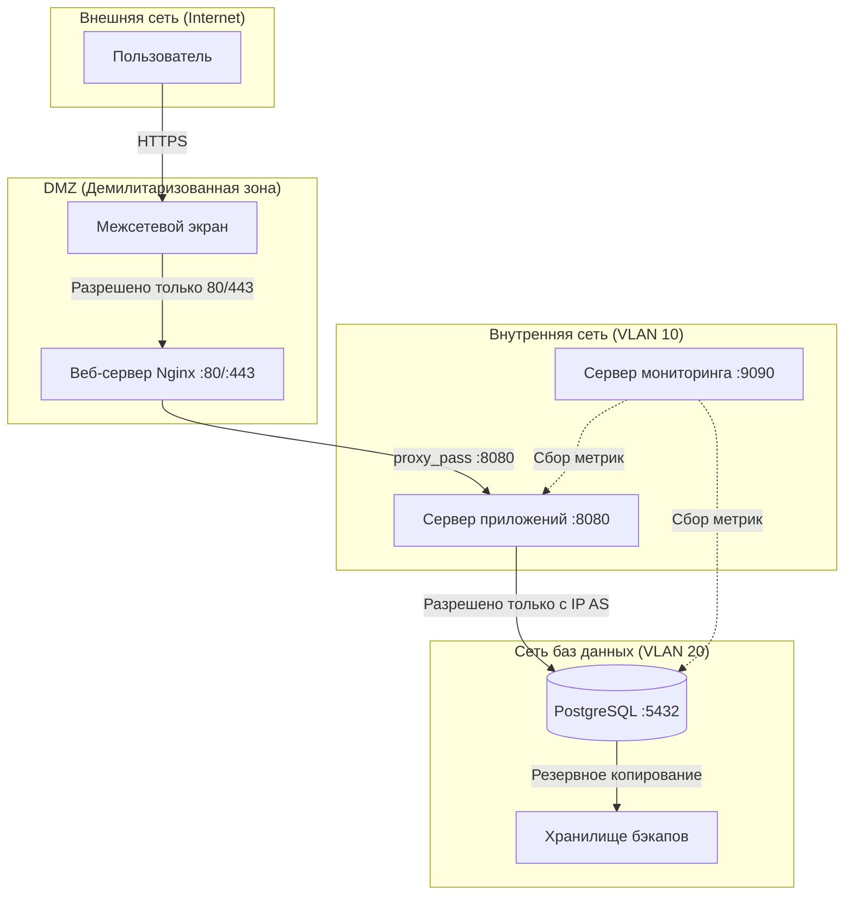
## Глава 3. Подключение

*Назначение раздела:* Данный раздел описывает физическое и логическое подключение серверного оборудования к сетевой инфраструктуре. Правильное подключение является фундаментом стабильной работы системы — ошибки на этом этапе могут привести к проблемам с производительностью, безопасностью или доступностью.

### 3.1. Физическое подключение

*Зачем это нужно:* Физическое подключение определяет надежность аппаратного уровня. Неправильное размещение кабелей или отсутствие резервирования может привести к простою системы при выходе из строя одного компонента.

**Последовательность действий:**

1. Установить серверы в стойку согласно схеме размещения (см. Рисунок 3.1)
2. Подключить серверы к источникам бесперебойного питания (ИБП) для защиты от перебоев электропитания
3. Подключить сетевые кабели к коммутатору согласно схеме сети
4. Подключить консольный кабель для первоначальной настройки (при необходимости)

*Рисунок 3.1 — Схема физического подключения серверов*

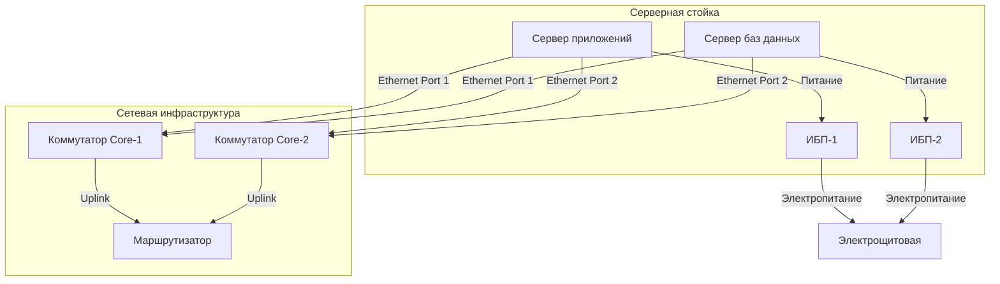

### 3.2. Сетевая конфигурация

*Что это такое:* Сетевая конфигурация определяет IP-адреса, маски подсети, шлюзы и DNS-серверы для каждого компонента системы. Правильная настройка обеспечивает маршрутизацию трафика и доступность сервисов.

Настроить сетевые интерфейсы серверов согласно таблице адресации:

*Таблица 3.1 — Таблица сетевой адресации*

| Компонент | IP-адрес | Маска | Шлюз | VLAN |
|-----------|----------|-------|------|------|
| Сервер приложений | 192.168.10.10 | 255.255.255.0 | 192.168.10.1 | VLAN 10 |
| Сервер баз данных | 192.168.20.10 | 255.255.255.0 | 192.168.20.1 | VLAN 20 |
| Веб-сервер (Nginx) | 192.168.10.20 | 255.255.255.0 | 192.168.10.1 | VLAN 10 |
| Сервер мониторинга | 192.168.10.30 | 255.255.255.0 | 192.168.10.1 | VLAN 10 |

**Для Linux (Ubuntu/Debian):**

```bash
# Редактирование сетевого интерфейса
sudo nano /etc/netplan/01-netcfg.yaml

# Пример конфигурации для сервера приложений
network:
  version: 2
  ethernets:
    eth0:
      addresses:
        - 192.168.10.10/24
      gateway4: 192.168.10.1
      nameservers:
        addresses: [8.8.8.8, 8.8.4.4]
      dhcp4: no

# Применение конфигурации
sudo netplan apply
```

**Для Windows Server:**

```powershell
# Настройка статического IP-адреса
New-NetIPAddress -InterfaceAlias "Ethernet" -IPAddress 192.168.10.10 -PrefixLength 24 -DefaultGateway 192.168.10.1
Set-DnsClientServerAddress -InterfaceAlias "Ethernet" -ServerAddresses 8.8.8.8, 8.8.4.4

# Проверка конфигурации
Get-NetIPAddress -InterfaceAlias "Ethernet"
```

### 3.3. Проверка подключения

*Зачем проверять:* Verification step ensures that all network paths are functional before proceeding to software installation. This prevents troubleshooting network issues later when they might be confused with application problems.

```bash
# Проверка сетевой связности с шлюзом
ping -c 4 192.168.10.1

# Проверка доступности DNS
ping -c 4 8.8.8.8

# Проверка доступности портов между серверами
telnet 192.168.20.10 5432

# Проверка маршрутов
traceroute 192.168.20.10

# Проверка сетевых интерфейсов
ip addr show
ip route show
```

*Рисунок 3.2 — Схема проверки сетевой связности*

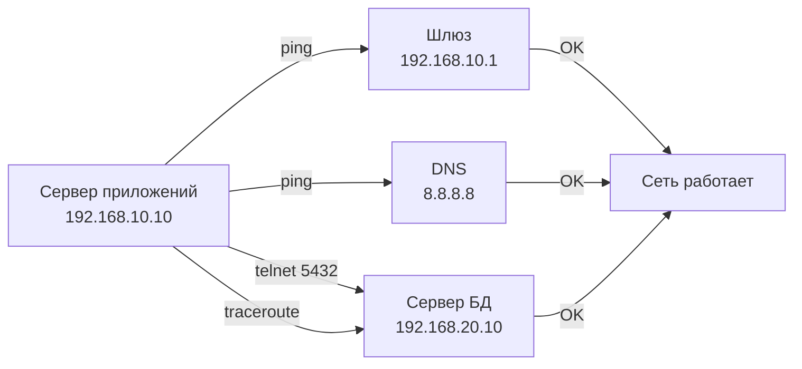

---
## Глава 4. Разворачивание системы

*Назначение раздела:* Раздел описывает пошаговый процесс установки всех программных компонентов системы. Правильное развертывание гарантирует, что все зависимости установлены, конфигурации применены корректно, и система готова к первоначальной настройке.

*Рисунок 4.1 — Общий процесс развертывания системы*

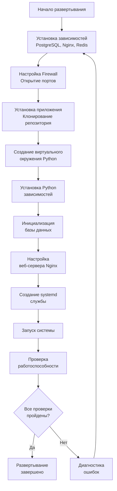

### 4.1. Подготовка среды

*Что такое зависимости:* Зависимости — это внешние программные компоненты (СУБД, веб-сервер, кэш), которые необходимы для работы приложения. Без них система не сможет функционировать.

#### 4.1.1. Установка зависимостей

**Для Ubuntu/Debian:**

```bash
# Обновление пакетного менеджера
sudo apt update
sudo apt upgrade -y

# Установка PostgreSQL (СУБД)
sudo apt install -y postgresql postgresql-contrib

# Установка Nginx (веб-сервер)
sudo apt install -y nginx

# Установка Python 3 и pip (менеджер пакетов)
sudo apt install -y python3 python3-pip python3-venv

# Установка Redis (кэш-сервер)
sudo apt install -y redis-server

# Проверка установки
postgresql --version
nginx -v
python3 --version
redis-server --version
```

**Для CentOS/RHEL:**

```bash
# Обновление системы
sudo yum update -y

# Установка PostgreSQL
sudo yum install -y postgresql-server postgresql-contrib

# Инициализация базы данных PostgreSQL
sudo postgresql-setup initdb

# Установка Nginx
sudo yum install -y nginx

# Установка Python 3
sudo yum install -y python3 python3-pip

# Установка Redis
sudo yum install -y redis

# Запуск служб
sudo systemctl start postgresql
sudo systemctl enable postgresql
```

#### 4.1.2. Настройка firewall

*Зачем нужен firewall:* Межсетевой экран контролирует входящий и исходящий сетевой трафик, блокируя несанкционированный доступ к серверам.

```bash
# Ubuntu (UFW - Uncomplicated Firewall)
sudo ufw allow 22/tcp      # SSH для удаленного управления
sudo ufw allow 80/tcp      # HTTP трафик
sudo ufw allow 443/tcp     # HTTPS трафик
sudo ufw allow 8080/tcp    # Внутренний API приложения
sudo ufw enable

# Проверка правил
sudo ufw status verbose

# CentOS (firewalld)
sudo firewall-cmd --permanent --add-port=22/tcp
sudo firewall-cmd --permanent --add-port=80/tcp
sudo firewall-cmd --permanent --add-port=443/tcp
sudo firewall-cmd --permanent --add-port=8080/tcp
sudo firewall-cmd --reload

# Проверка правил
sudo firewall-cmd --list-all
```

*Рисунок 4.2 — Схема сетевых портов и их назначения*

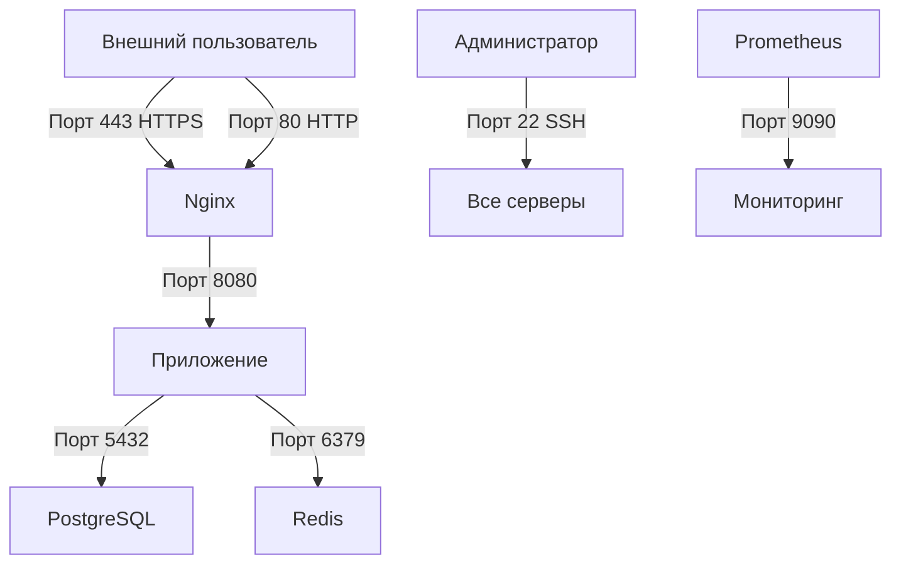

### 4.2. Установка системы

*Что происходит на этом этапе:* Клонируется исходный код приложения из репозитория, создается изолированное виртуальное окружение Python для установки зависимостей проекта без конфликтов с системными пакетами.

```bash
# Создание директории для приложения
sudo mkdir -p /opt/system
sudo chown $USER:$USER /opt/system

# Клонирование репозитория
git clone https://github.com/[organization]/[system-name].git /opt/system
cd /opt/system

# Создание виртуального окружения Python
python3 -m venv venv

# Активация виртуального окружения
source venv/bin/activate

# Обновление pip
pip install --upgrade pip
# Установка зависимостей проекта
pip install -r requirements.txt

# Создание файла конфигурации из шаблона
cp config.example.py config.py

# Редактирование конфигурации
nano config.py
```

### 4.3. Инициализация базы данных

*Зачем это нужно:* База данных должна быть создана, настроены права доступа пользователя, и применены миграции схемы данных перед запуском приложения.

```bash
# Вход в консоль PostgreSQL
sudo -u postgres psql

# Создание базы данных
CREATE DATABASE system_db;

# Создание пользователя с паролем
CREATE USER system_user WITH PASSWORD 'secure_password_here';

# Настройка кодировки и прав
ALTER ROLE system_user SET client_encoding TO 'utf8';
ALTER ROLE system_user SET default_transaction_isolation TO 'read committed';
ALTER ROLE system_user SET timezone TO 'UTC';

# Предоставление прав на базу данных
GRANT ALL PRIVILEGES ON DATABASE system_db TO system_user;

# Выход из консоли
\q

# Возврат в виртуальное окружение
source /opt/system/venv/bin/activate

# Применение миграций схемы базы данных
python manage.py migrate

# Загрузка начальных данных (справочники, настройки)
python manage.py loaddata initial_data.json

# Создание суперпользователя для администрирования
python manage.py createsuperuser
```

### 4.4. Настройка веб-сервера

*Роль Nginx:* Nginx выступает как reverse proxy — принимает запросы от пользователей, обрабатывает SSL/TLS шифрование, раздает статические файлы и передает динамические запросы приложению на порту 8080.

```bash
# Создание конфигурационного файла для сайта
sudo nano /etc/nginx/sites-available/system

# Содержимое конфигурации:
```

```nginx
server {
    listen 80;
    server_name system.[organization].com;
    
    # Логирование
    access_log /var/log/nginx/system_access.log;
    error_log /var/log/nginx/system_error.log;
    
    # Статические файлы
    location /static/ {
        alias /opt/system/static/;
    }
    
    # Медиа файлы
    location /media/ {
        alias /opt/system/media/;
    }
    
    # Проксирование на приложение
    location / {
        proxy_pass http://127.0.0.1:8080;
        proxy_set_header Host $host;
        proxy_set_header X-Real-IP $remote_addr;
        proxy_set_header X-Forwarded-For $proxy_add_x_forwarded_for;
        proxy_set_header X-Forwarded-Proto $scheme;
    }
}
```

```bash
# Активация сайта (создание символической ссылки)
sudo ln -s /etc/nginx/sites-available/system /etc/nginx/sites-enabled/

# Удаление конфигурации по умолчанию (если не нужна)
sudo rm /etc/nginx/sites-enabled/default

# Проверка конфигурации на ошибки
sudo nginx -t

# Перезапуск Nginx для применения изменений
sudo systemctl restart nginx
```

### 4.5. Запуск системы

*Что такое systemd служба:* systemd — это система инициализации Linux, которая управляет службами (демонами). Создание службы позволяет приложению запускаться автоматически при загрузке сервера и перезапускаться при сбоях.

```bash
# Создание файла службы systemd
sudo nano /etc/systemd/system/system.service

# Содержимое файла службы:
```

```ini
[Unit]
Description=[Название Информационной Системы] Application
After=network.target postgresql.service redis.service
Requires=postgresql.service redis.service

[Service]
Type=simple
User=system_user
Group=system_user
WorkingDirectory=/opt/system
Environment="PATH=/opt/system/venv/bin"
ExecStart=/opt/system/venv/bin/python manage.py runserver 0.0.0.0:8080
ExecReload=/bin/kill -s HUP $MAINPID
Restart=always
RestartSec=10
StandardOutput=journal
StandardError=journal
SyslogIdentifier=system

[Install]
WantedBy=multi-user.target
```

```bash
# Перезагрузка systemd для обнаружения новой службы
sudo systemctl daemon-reload

# Включение автозапуска при загрузке системы
sudo systemctl enable system

# Запуск службы
sudo systemctl start system

# Проверка статуса службы
sudo systemctl status system
```

### 4.6. Проверка развертывания

*Зачем проверять:* Финальная проверка гарантирует, что все компоненты установлены корректно и система готова к эксплуатации.

```bash
# Проверка статуса всех служб
sudo systemctl status system
sudo systemctl status nginx
sudo systemctl status postgresql
sudo systemctl status redis

# Проверка доступности приложения
curl -I http://localhost:8080
curl -I http://localhost

# Проверка логов приложения в реальном времени
sudo journalctl -u system -f

# Проверка логов Nginx
sudo tail -f /var/log/nginx/system_error.log

# Проверка подключения к базе данных
sudo -u postgres psql -d system_db -c "SELECT current_user, current_database();"

# Проверка Redis
redis-cli ping
```

*Рисунок 4.3 — Диаграмма проверки работоспособности системы*

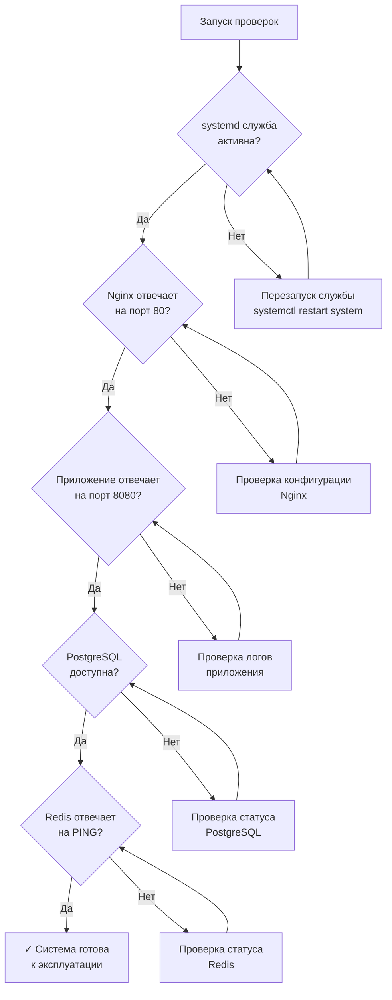
## Глава 5. Первоначальная настройка

*Назначение раздела:* После успешного развертывания системы необходимо выполнить её первоначальную настройку — создать учётную запись администратора, настроить параметры безопасности, подключить SSL/TLS-сертификат и настроить мониторинг. Эти действия переводят систему из состояния «установлена» в состояние «готова к промышленной эксплуатации».

*Рисунок 5.1 — Процесс первоначальной настройки системы*

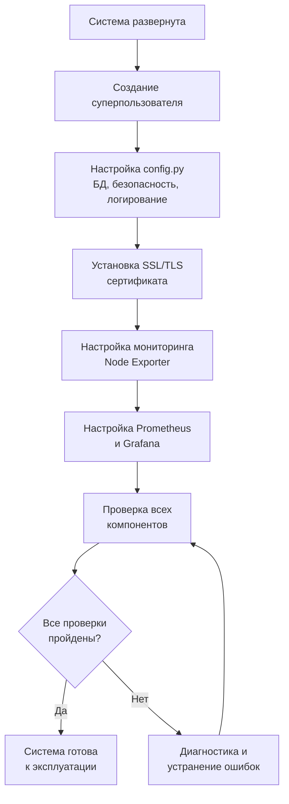

### 5.1. Создание учетной записи администратора

*Зачем это нужно:* Учетная запись суперпользователя (superuser) предоставляет полный доступ к административной панели системы. Без неё невозможно управлять пользователями, ролями и настройками через веб-интерфейс.

*Как это сделать:* Команда createsuperuser запускает интерактивный диалог, в котором необходимо указать имя пользователя, email и пароль.

```bash
# Переход в директорию проекта и активация виртуального окружения
cd /opt/system
source venv/bin/activate

# Создание суперпользователя
python manage.py createsuperuser

# Интерактивный диалог запросит:
# Username: admin
# Email address: admin@[organization].com
# Password: ********
# Password (again): ********
# Superuser created successfully.
```

*Рекомендации по безопасности:*
- Используйте пароль длиной не менее 12 символов
- Включайте заглавные и строчные буквы, цифры и специальные символы
- Не используйте словарные слова и личные данные
- Сохраните учетные данные в защищенном менеджере паролей

### 5.2. Настройка параметров системы

*Что такое config.py:* Это основной файл конфигурации приложения, в котором задаются параметры подключения к базе данных, настройки безопасности, режим отладки и параметры логирования. Неправильная конфигурация может привести к утечкам данных или неработоспособности системы.

Отредактировать файл конфигурации:

```bash
nano /opt/system/config.py
```

```python
# ============================================================
# ОСНОВНЫЕ ПАРАМЕТРЫ
# ============================================================
# DEBUG=True выводит детальную информацию об ошибках,
# но НЕ ДОЛЖЕН использоваться в промышленной среде
DEBUG = False

# Список разрешенных доменов для защиты от HTTP Host Header атак
ALLOWED_HOSTS = ['system.[organization].com', 'localhost', '127.0.0.1']

# ============================================================
# ПОДКЛЮЧЕНИЕ К БАЗЕ ДАННЫХ
# ============================================================
DATABASES = {
    'default': {
        'ENGINE': 'django.db.backends.postgresql',
        'NAME': 'system_db',
        'USER': 'system_user',
        'PASSWORD': 'secure_password_here',  # Заменить на реальный пароль
        'HOST': '192.168.20.10',             # IP сервера БД
        'PORT': '5432',
        'OPTIONS': {
            'connect_timeout': 10,
        },
    }
}

# ============================================================
# ПАРАМЕТРЫ БЕЗОПАСНОСТИ
# ============================================================
# Секретный ключ для криптографической подписи сессий и токенов
SECRET_KEY = 'change-this-to-random-64-char-string-in-production'

# Принудительное использование HTTPS для cookies
SESSION_COOKIE_SECURE = True
CSRF_COOKIE_SECURE = True

# Защита от XSS-атак
SECURE_BROWSER_XSS_FILTER = True
SECURE_CONTENT_TYPE_NOSNIFF = True

# HSTS заголовок (1 год)
SECURE_HSTS_SECONDS = 31536000
SECURE_HSTS_INCLUDE_SUBDOMAINS = True
SECURE_HSTS_PRELOAD = True

# ============================================================
# ЛОГИРОВАНИЕ
# ============================================================
LOGGING = {
    'version': 1,
    'disable_existing_loggers': False,
    'formatters': {
        'verbose': {
            'format': '{levelname} {asctime} {module} {message}',
            'style': '{',
        },
    },
    'handlers': {
        'file': {
            'level': 'INFO',
            'class': 'logging.FileHandler',
            'filename': '/var/log/system/app.log',
            'formatter': 'verbose',
        },
        'error_file': {
            'level': 'ERROR',
            'class': 'logging.FileHandler',
            'filename': '/var/log/system/error.log',
            'formatter': 'verbose',
        },
    },
    'loggers': {
        'django': {
            'handlers': ['file', 'error_file'],
            'level': 'INFO',
            'propagate': True,
        },
        'system': {
            'handlers': ['file', 'error_file'],
            'level': 'DEBUG',
            'propagate': True,
        },
    },
}
```

### 5.3. Настройка SSL/TLS

*Зачем нужен SSL/TLS:* Протокол HTTPS шифрует трафик между пользователем и сервером, защищая передаваемые данные (пароли, персональную информацию) от перехвата. Без HTTPS браузеры помечают сайт как «небезопасный».

*Что такое Certbot:* Certbot — бесплатный инструмент от Electronic Frontier Foundation для автоматического получения и обновления SSL-сертификатов от Let's Encrypt.

```bash
# Установка Certbot и плагина для Nginx
sudo apt install -y certbot python3-certbot-nginx

# Получение и автоматическая установка сертификата
sudo certbot --nginx -d system.[organization].com

# Certbot автоматически:
# 1. Проверит владение доменом
# 2. Получит сертификат
# 3. Изменит конфигурацию Nginx для использования HTTPS
# 4. Настроит редирект с HTTP на HTTPS

# Проверка автоматического обновления сертификата
sudo certbot renew --dry-run

# Сертификаты Let's Encrypt действительны 90 дней.
# Certbot добавляет задачу в cron для автоматического обновления:
sudo systemctl status certbot.timer
```

*Рисунок 5.2 — Схема работы SSL/TLS шифрования*

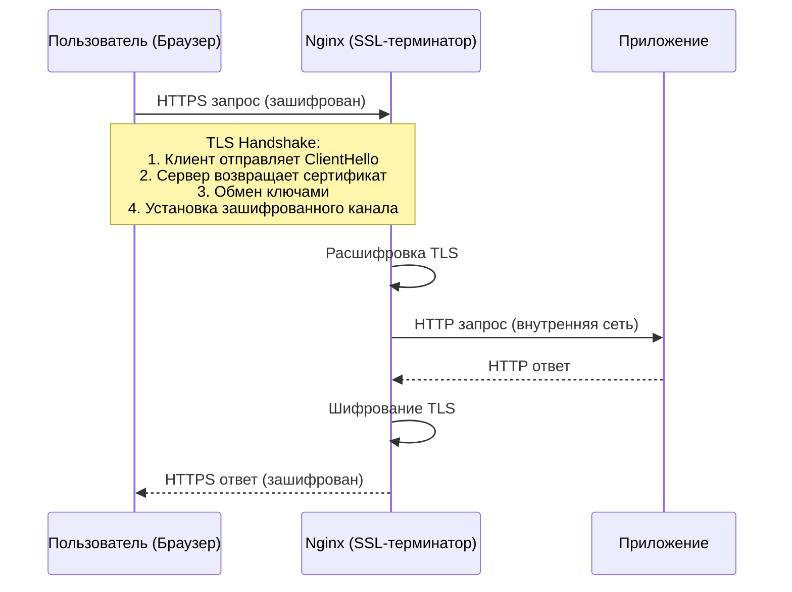

### 5.4. Настройка мониторинга

*Зачем нужен мониторинг:* Мониторинг позволяет администратору в реальном времени отслеживать состояние системы: загрузку CPU, использование памяти, дисковое пространство, доступность сервисов. Это критически важно для раннего обнаружения проблем до того, как они приведут к простою.

*Что такое Prometheus и Node Exporter:*
- **Node Exporter** — агент, собирающий метрики операционной системы (CPU, RAM, диск, сеть)
- **Prometheus** — система сбора и хранения метрик с мощным языком запросов PromQL
- **Grafana** — система визуализации метрик в виде дашбордов

#### 5.4.1. Установка Node Exporter на все серверы

```bash
# Создание пользователя для Node Exporter
sudo useradd --no-create-home --shell /bin/false node_exporter

# Скачивание и установка
wget https://github.com/prometheus/node_exporter/releases/download/v1.6.1/node_exporter-1.6.1.linux-amd64.tar.gz
tar xvfz node_exporter-1.6.1.linux-amd64.tar.gz
sudo cp node_exporter-1.6.1.linux-amd64/node_exporter /usr/local/bin/
sudo chown node_exporter:node_exporter /usr/local/bin/node_exporter

# Создание systemd службы
sudo nano /etc/systemd/system/node_exporter.service
```

```ini
[Unit]
Description=Node Exporter
Wants=network-online.target
After=network-online.target

[Service]
User=node_exporter
Group=node_exporter
Type=simple
ExecStart=/usr/local/bin/node_exporter \
    --collector.systemd \
--collector.processes \
    --web.listen-address=:9100

[Install]
WantedBy=multi-user.target
```

```bash
# Запуск службы
sudo systemctl daemon-reload
sudo systemctl enable node_exporter
sudo systemctl start node_exporter

# Проверка
curl http://localhost:9100/metrics | head -20
```

#### 5.4.2. Установка Prometheus на сервер мониторинга

```bash
# Создание пользователя
sudo useradd --no-create-home --shell /bin/false prometheus

# Создание директорий
sudo mkdir /etc/prometheus /var/lib/prometheus

# Скачивание и установка
wget https://github.com/prometheus/prometheus/releases/download/v2.47.0/prometheus-2.47.0.linux-amd64.tar.gz
tar xvfz prometheus-2.47.0.linux-amd64.tar.gz
sudo cp prometheus-2.47.0.linux-amd64/prometheus /usr/local/bin/
sudo cp prometheus-2.47.0.linux-amd64/promtool /usr/local/bin/
sudo cp -r prometheus-2.47.0.linux-amd64/consoles /etc/prometheus
sudo cp -r prometheus-2.47.0.linux-amd64/console_libraries /etc/prometheus

# Настройка конфигурации
sudo nano /etc/prometheus/prometheus.yml
```

```yaml
global:
  scrape_interval: 15s
  evaluation_interval: 15s

scrape_configs:
  - job_name: 'prometheus'
    static_configs:
      - targets: ['localhost:9090']

  - job_name: 'app_server'
    static_configs:
      - targets: ['192.168.10.10:9100']
        labels:
          instance: 'app-server'

  - job_name: 'db_server'
    static_configs:
      - targets: ['192.168.20.10:9100']
        labels:
          instance: 'db-server'

  - job_name: 'nginx'
    static_configs:
      - targets: ['192.168.10.20:9100']
        labels:
          instance: 'nginx-server'
```

```bash
# Настройка прав
sudo chown -R prometheus:prometheus /etc/prometheus /var/lib/prometheus

# Создание systemd службы
sudo nano /etc/systemd/system/prometheus.service
```

```ini
[Unit]
Description=Prometheus
Wants=network-online.target
After=network-online.target

[Service]
User=prometheus
Group=prometheus
Type=simple
ExecStart=/usr/local/bin/prometheus \
    --config.file=/etc/prometheus/prometheus.yml \
    --storage.tsdb.path=/var/lib/prometheus/ \
    --web.console.templates=/etc/prometheus/consoles \
    --web.console.libraries=/etc/prometheus/console_libraries \
    --web.listen-address=0.0.0.0:9090

[Install]
WantedBy=multi-user.target
```

```bash
sudo systemctl daemon-reload
sudo systemctl enable prometheus
sudo systemctl start prometheus
```

#### 5.4.3. Расписание мониторинга

*Таблица 5.1 — Расписание мониторинга и проверки системы*

| Компонент | Метрика | Интервал сбора | Порог предупреждения | Порог критичности |
|-----------|---------|---------------|---------------------|-------------------|
| CPU | Загрузка | 15 сек | > 70% | > 90% |
| RAM | Использование | 15 сек | > 75% | > 90% |
| Диск | Свободное место | 60 сек | < 20% | < 10% |
| Сеть | Ошибки пакетов | 15 сек | > 0.1% | > 1% |
| PostgreSQL | Активные соединения | 30 сек | > 80% от max | > 95% от max |
| PostgreSQL | Время отклика запроса | 30 сек | > 500 мс | > 2000 мс |
| Redis | Использование памяти | 30 сек | > 70% | > 90% |
| Nginx | Активные соединения | 15 сек | > 1000 | > 5000 |
| Приложение | Время отклика HTTP | 30 сек | > 1000 мс | > 5000 мс |
| Приложение | Ошибки 5xx | 15 сек | > 1% | > 5% |

*Рисунок 5.3 — Архитектура системы мониторинга*

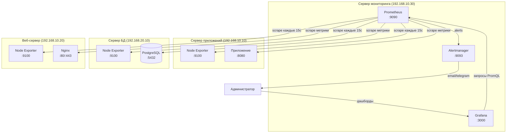

---

## Глава 6. Заведение ролей

*Назначение раздела:* Ролевая модель (RBAC — Role-Based Access Control) определяет, какие действия может выполнять каждый пользователь в системе. Правильная настройка ролей критически важна для информационной безопасности — она реализует принцип минимальных привилегий, при котором пользователь получает только те права, которые необходимы для выполнения его рабочих задач.

*Рисунок 6.1 — Иерархия ролей и прав доступа*

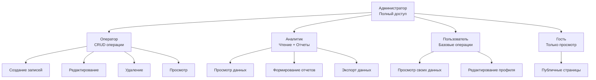

### 6.1. Предопределенные роли системы

*Что такое предопределенные роли:* Это роли, которые создаются автоматически при первом запуске системы и покрывают типовые сценарии использования. Они служат основой, которую администратор может расширять по мере необходимости.

*Таблица 6.1 — Роли и права доступа*

| Роль | Права доступа | Описание | Типичный пользователь |
|------|--------------|----------|----------------------|
| Администратор | Полный доступ ко всем функциям системы | Управление системой, пользователями, настройками, резервным копированием | Системный администратор |
| Оператор | Просмотр, создание, редактирование и удаление данных | Работа с основными данными системы, обработка заявок | Оператор отдела |
| Аналитик | Просмотр данных и формирование отчетов | Анализ данных, создание отчетов, экспорт в Excel/PDF | Бизнес-аналитик |
| Пользователь | Базовые операции с собственными данными | Просмотр информации, работа с личным профилем | Рядовой сотрудник |
| Гость | Только просмотр публичной информации | Ограниченный доступ к публичным разделам | Внешний посетитель |

### 6.2. Создание новой роли

*Зачем создавать новые роли:* Предопределенные роли могут не покрывать все бизнес-сценарии организации. Например, может потребоваться роль «Модератор» с правами на просмотр и редактирование, но без права удаления данных.

**Способ 1: Через веб-интерфейс администратора**

1. Войти в систему под учетной записью администратора
2. Перейти в раздел «Администрирование» → «Управление ролями»
3. Нажать кнопку «Создать роль»
4. Указать название и описание роли
5. Настроить матрицу прав доступа (отметить нужные чекбоксы)
6. Нажать «Сохранить»

**Способ 2: Через командную строку (Django shell)**

```bash
cd /opt/system
source venv/bin/activate
python manage.py shell
```

```python
from django.contrib.auth.models import Group, Permission
from django.contrib.contenttypes.models import ContentType

# Создание новой группы (роли)
group = Group.objects.create(name='Модератор')
group.description = 'Просмотр и редактирование без права удаления'

# Получение модели, для которой назначаются права
from system.models import Document
content_type = ContentType.objects.get_for_model(Document)

# Добавление конкретных прав
permissions = Permission.objects.filter(
    content_type=content_type,
    codename__in=['view_document', 'add_document', 'change_document']
)
group.permissions.add(*permissions)
group.save()

print(f"Роль '{group.name}' создана с правами: {group.permissions.count()}")
```

### 6.3. Назначение роли пользователю

*Как это работает:* В Django роли реализованы через механизм Groups. Пользователь может состоять в нескольких группах одновременно, получая совокупность прав всех своих групп.

```python
from django.contrib.auth.models import User, Group

# Получение пользователя и роли
user = User.objects.get(username='ivanov')
group = Group.objects.get(name='Модератор')

# Назначение роли
user.groups.add(group)
user.save()

# Проверка назначенных ролей
print(f"Роли пользователя {user.username}:")
for g in user.groups.all():
    print(f"  - {g.name}")
```

*Через веб-интерфейс:*
1. Перейти в «Администрирование» → «Пользователи»
2. Выбрать нужного пользователя
3. В разделе «Группы» добавить требуемую роль
4. Сохранить изменения

### 6.4. Аудит ролей

*Зачем нужен аудит:* Регулярная проверка назначенных ролей выявляет нарушения принципа минимальных привилегий — ситуации, когда пользователи имеют избыточные права (например, уволенные сотрудники с активными учетными записями).

**Регламент аудита:**
- Полная проверка — раз в квартал
- Выборочная проверка новых назначений — ежемесячно
- Проверка учетных записей уволенных сотрудников — немедленно при увольнении

```bash
# Экспорт списка пользователей и их ролей
cd /opt/system
source venv/bin/activate

python manage.py shell -c "
from django.contrib.auth.models import User
import csv

with open('/var/log/system/user_roles_audit.csv', 'w', newline='') as f:
    writer = csv.writer(f)
    writer.writerow(['Username', 'Email', 'Is Active', 'Is Staff', 'Groups', 'Last Login'])
    
    for user in User.objects.all().order_by('username'):
        groups = ', '.join([g.name for g in user.groups.all()])
        writer.writerow([
            user.username,
            user.email,
            user.is_active,
            user.is_staff,
            groups,
            user.last_login
        ])

print('Аудит завершен. Результат: /var/log/system/user_roles_audit.csv')
"
```

*Рисунок 6.2 — Процесс назначения и аудита ролей*

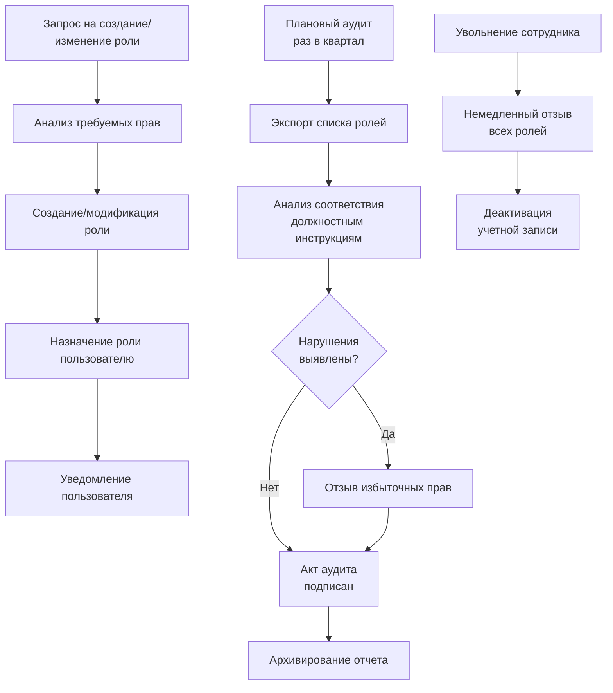
## Глава 7. Техническое обслуживание

*Назначение раздела:* Данный раздел описывает регламентные процедуры, необходимые для поддержания [Название Информационной Системы] в работоспособном состоянии. Регулярное техническое обслуживание (ТО) позволяет предотвратить аварийные ситуации, выявить деградацию производительности на ранних стадиях и обеспечить соответствие системы требованиям информационной безопасности [Название Организации].

### 7.1. Техобслуживание аппаратного обеспечения

*Что это такое:* Аппаратное обеспечение (серверы, сетевое оборудование, системы хранения) подвержено физическому износу. Профилактическое обслуживание минимизирует риск внезапных отказов, которые могут привести к простою системы и потере данных.

#### 7.1.1. Регламент технического обслуживания

*Таблица 7.1 — График технического обслуживания аппаратного обеспечения*

| Операция | Периодичность | Ответственный | Примечание |
|----------|--------------|---------------|------------|
| Визуальный осмотр серверов и коммутаторов | Ежемесячно | Инженер АО | Проверка индикации, целостности кабелей, отсутствия пыли |
| Очистка серверных стоек от пыли | Раз в 6 месяцев | Инженер АО | Использование специализированного сжатого воздуха |
| Проверка температурного режима | Еженедельно | Система мониторинга | Автоматический сбор данных с датчиков (CPU, HDD, помещение) |
| Тестирование ИБП (автономная работа) | Ежемесячно | Инженер АО | Имитация отключения электропитания на 5-10 минут |
| Проверка состояния дисков (S.M.A.R.T.) | Еженедельно | Система мониторинга | Автоматическая проверка через утилиту `smartctl` |
| Замена термопасты на процессорах | Раз в 2 года | Инженер АО | Только при превышении штатных температурных лимитов |

#### 7.1.2. Мониторинг аппаратного обеспечения

*Зачем это нужно:* Непрерывный мониторинг позволяет перейти от реактивного устранения неисправностей (когда уже что-то сломалось) к проактивному предотвращению сбоев (замена диска до его полного отказа).

```bash
# Проверка температуры процессора и системы
sensors

# Проверка состояния дисков (S.M.A.R.T.)
sudo smartctl -a /dev/sda

# Проверка использования ресурсов в реальном времени
htop
df -h
free -h

# Проверка состояния RAID-массива (пример для MegaRAID)
sudo megacli -PDList -aAll | grep "Firmware state"
```

*Рисунок 7.1 — Процесс реакции системы мониторинга на аппаратные события*

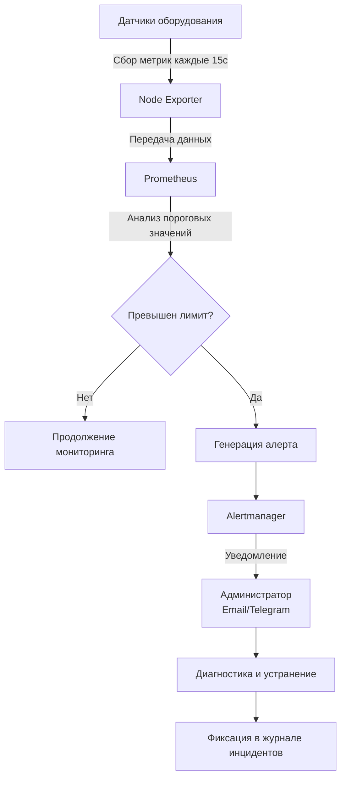

#### 7.1.3. Действия при обнаружении неисправностей

*Алгоритм действий:*
1. Зафиксировать симптомы неисправности (время, характер ошибки, затронутые компоненты).
2. Проверить журналы событий системы и аппаратные логи (IPMI, iLO).
3. Выполнить диагностику согласно инструкциям производителя оборудования.
4. При необходимости заменить неисправный компонент из резервного фонда.
5. Задокументировать инцидент в журнале технического обслуживания.

### 7.2. Техобслуживание программного обеспечения

*Что это такое:* Программное обеспечение требует регулярного обновления для устранения уязвимостей безопасности, исправления ошибок и улучшения производительности.

#### 7.2.1. Обновление системы

*Зачем это нужно:* Обновление закрывает известные уязвимости и обеспечивает стабильность работы. **Важно:** перед любым обновлением обязательно создается резервная копия.

```bash
# 1. Создание резервной копии перед обновлением (обязательно!)
python manage.py dumpdata > /backup/pre_update_backup_$(date +%Y%m%d).json

# 2. Обновление системных зависимостей ОС
sudo apt update
sudo apt upgrade -y

# 3. Обновление зависимостей приложения
source /opt/system/venv/bin/activate
pip install --upgrade -r requirements.txt

# 4. Применение миграций базы данных (если есть изменения в модели)
python manage.py migrate

# 5. Сбор статических файлов
python manage.py collectstatic --noinput

# 6. Перезапуск службы для применения изменений
sudo systemctl restart system
```

#### 7.2.2. Управление логами

*Что такое ротация логов:* Файлы логов со временем занимают все дисковое пространство. Ротация автоматически архивирует старые логи и удаляет их по истечении заданного срока, предотвращая переполнение диска.

```bash
# Настройка ротации логов приложения
sudo nano /etc/logrotate.d/system

/var/log/system/*.log {
    daily               # Ротация ежедневно
    missingok           # Не выдавать ошибку, если файл отсутствует
    rotate 30           # Хранить 30 архивов
    compress            # Сжимать архивы (gzip)
    delaycompress       # Сжимать со второго раза (чтобы не сжимать активный файл)
    notifempty          # Не ротировать пустые файлы
    create 0640 system_user system_user # Права на новый файл
    sharedscripts
    postrotate
        systemctl reload system > /dev/null 2>/dev/null || true
    endscript
}
```

#### 7.2.3. Оптимизация производительности

*Зачем это нужно:* Со временем в базе данных накапливаются "мертвые" строки (после удалений/обновлений), а кэш заполняется устаревшими данными. Регулярная оптимизация возвращает системе исходную скорость отклика.

```bash
# Оптимизация базы данных PostgreSQL (удаление мертвых строк и обновление статистики)
sudo -u postgres psql -d system_db -c "VACUUM ANALYZE;"
sudo -u postgres psql -d system_db -c "REINDEX DATABASE system_db;"

# Очистка устаревших данных из кэша Redis
redis-cli FLUSHDB

# Очистка временных файлов системы (старше 7 дней)
sudo find /tmp -type f -mtime +7 -delete
```

#### 7.2.4. Расписание мониторинга программного обеспечения

*Назначение:* Регламент проверки состояния ПО для обеспечения его стабильной работы и раннего выявления аномалий.

*Таблица 7.2 — Расписание мониторинга и проверок ПО*

| Компонент | Проверяемый параметр | Периодичность | Инструмент проверки | Критический порог |
|-----------|---------------------|---------------|---------------------|-------------------|
| ОС (Linux) | Свободное место на диске (/) | Ежечасно | Node Exporter | < 15% |
| ОС (Linux) | Загрузка CPU (Load Average) | Ежечасно | Node Exporter | > 80% в течение 15 мин |
| PostgreSQL | Количество активных подключений | Каждые 5 мин | postgres_exporter | > 90% от `max_connections` |
| PostgreSQL | Длительные транзакции (> 1 мин) | Каждые 5 мин | postgres_exporter | > 5 транзакций |
| Redis | Использование оперативной памяти | Каждые 5 мин | redis_exporter | > 85% от `maxmemory` |
| Nginx | Количество HTTP 5xx ошибок | Ежечасно | nginx_exporter | > 1% от общего трафика |
| Приложение | Время отклика API (95-й перцентиль) | Каждые 5 мин | Prometheus / APM | > 2000 мс |
| Приложение | Статус systemd службы `system` | Ежечасно | Systemd / Мониторинг | Статус `inactive` или `failed` |

*Рисунок 7.2 — Взаимодействие компонентов при сборе метрик ПО*

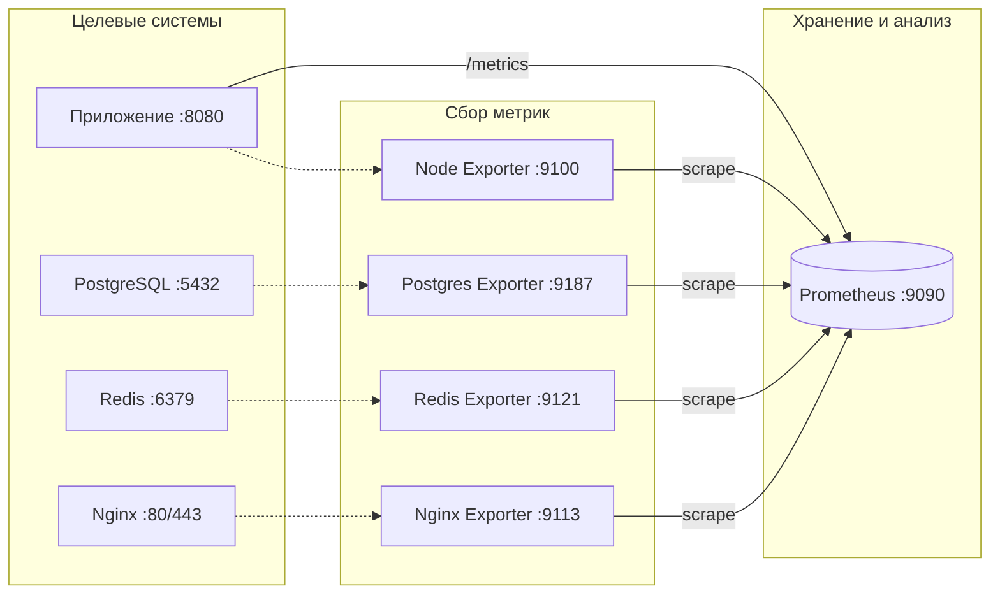

#### 7.2.5. Мониторинг ПО в реальном времени (ручная проверка)

```bash
# Проверка статуса всех критических служб
sudo systemctl status system postgresql nginx redis

# Просмотр логов приложения в реальном времени (последние 50 строк)
sudo journalctl -u system -n 50 -f

# Просмотр логов ошибок веб-сервера
sudo tail -f /var/log/nginx/error.log
# Проверка активных запросов к базе данных
sudo -u postgres psql -d system_db -c "SELECT pid, now() - pg_stat_activity.query_start AS duration, query, state FROM pg_stat_activity WHERE state != 'idle';"
```
## Глава 8. Резервное копирование

*Назначение раздела:* Данный раздел описывает политику и процедуры создания резервных копий [Название ИС]. Резервное копирование — это последняя линия обороны против потери данных в результате аппаратных сбоев, человеческих ошибок, вредоносного ПО (шифровальщиков) или стихийных бедствий. 

*Основной принцип:* Мы следуем индустриальному стандарту **«Правило 3-2-1»**:
- **3** копии данных (1 оригинал + 2 резервные копии).
- **2** разных типа носителей (например, локальный SSD и сетевое хранилище NAS).
- **1** копия вне площадки (offsite, например, облако или удаленный сервер).

*Рисунок 8.1 — Архитектура потоков резервного копирования*
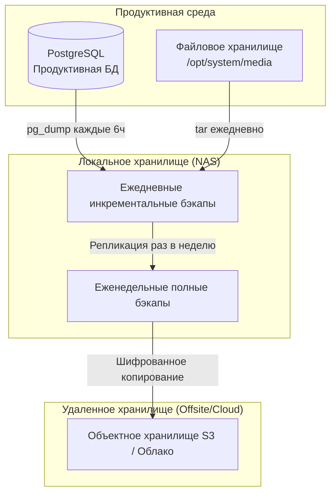

### 8.1. Стратегия резервного копирования

*Что это такое:* Стратегия определяет частоту, типы и методы создания копий. Комбинированный подход позволяет балансировать между нагрузкой на сервер и скоростью восстановления.

Система использует комбинированную стратегию:
- **Полное резервное копирование (Full Backup):** Создает полную копию всех данных. Требует много времени и места, но восстановление происходит быстрее всего. Выполняется еженедельно.
- **Инкрементальное резервное копирование (Incremental Backup):** Сохраняет только данные, изменившиеся с момента последнего бэкапа (любого типа). Быстро создается, но восстановление требует применения цепочки бэкапов. Выполняется ежедневно.

### 8.2. Процедура резервного копирования

#### 8.2.1. Резервное копирование базы данных

*Зачем использовать формат `-F c`:* Формат `custom` (c) в PostgreSQL позволяет сжимать данные на лету, разбивать бэкап на части и восстанавливать отдельные таблицы, а не только всю базу целиком.

```bash
#!/bin/bash
# Скрипт резервного копирования БД /opt/system/scripts/backup_db.sh

# Переменные окружения
BACKUP_DIR="/backup/database"
DATE=$(date +%Y%m%d_%H%M%S)
DB_NAME="system_db"
DB_USER="system_user"
RETENTION_DAYS=30

# Создание директории, если её нет
mkdir -p $BACKUP_DIR

# Создание резервной копии в сжатом custom-формате
pg_dump -U $DB_USER -d $DB_NAME -F c -f $BACKUP_DIR/db_backup_$DATE.dump

# Сжатие (дополнительно, если не использовался флаг -Z в pg_dump)
gzip $BACKUP_DIR/db_backup_$DATE.dump

# Удаление старых бэкапов
find $BACKUP_DIR -type f -name "*.dump.gz" -mtime +$RETENTION_DAYS -delete

# Логирование операции
echo "$(date '+%Y-%m-%d %H:%M:%S'): Успешно создан бэкап db_backup_$DATE.dump.gz" >> /var/log/system/backup.log
```

#### 8.2.2. Резервное копирование файлов

*Что копируем:* Статические файлы, загруженные пользователями (документы, изображения), а также конфигурационные файлы системы.

```bash
#!/bin/bash
# Скрипт резервного копирования файлов /opt/system/scripts/backup_files.sh

BACKUP_DIR="/backup/files"
SOURCE_DIR="/opt/system"
DATE=$(date +%Y%m%d_%H%M%S)
RETENTION_DAYS=90

mkdir -p $BACKUP_DIR

# Создание архива с исключением виртуального окружения и кэша
tar -czf $BACKUP_DIR/files_backup_$DATE.tar.gz \
    --exclude='venv' \
    --exclude='__pycache__' \
    --exclude='*.pyc' \
    $SOURCE_DIR

# Удаление старых архивов
find $BACKUP_DIR -type f -name "*.tar.gz" -mtime +$RETENTION_DAYS -delete

echo "$(date '+%Y-%m-%d %H:%M:%S'): Успешно создан архив files_backup_$DATE.tar.gz" >> /var/log/system/backup.log
```

### 8.3. Расписание резервного копирования

*Таблица 8.1 — Регламент резервного копирования и проверки*
| Тип операции | Объект копирования | Частота | Время выполнения | Срок хранения | Ответственный |
|--------------|-------------------|---------|-----------------|---------------|---------------|
| Инкрементальный бэкап | База данных (PostgreSQL) | Ежедневно | 02:00 | 30 дней | Cron / Скрипт |
| Инкрементальный бэкап | Файлы и конфиги | Ежедневно | 03:00 | 90 дней | Cron / Скрипт |
| Полный бэкап | База данных | Еженедельно (Вс) | 02:00 | 180 дней | Cron / Скрипт |
| Полный бэкап | Файлы и конфиги | Еженедельно (Вс) | 04:00 | 365 дней | Cron / Скрипт |
| **Проверка целостности** | Случайный бэкап БД | Еженедельно (Пн) | 08:00 | - | Администратор |
| **Тестовое восстановление** | Полная копия на тестовый стенд | Ежемесячно | 1-е число | - | Администратор |

### 8.4. Настройка автоматического выполнения

*Как работает cron:* `cron` — это демон планирования задач в Linux. Он позволяет запускать скрипты автоматически по расписанию без участия человека.

```bash
# Добавление задач в cron для пользователя root или system_user
sudo crontab -e

# Резервное копирование БД каждые 6 часов (для высокой RPO)
0 */6 * * * /opt/system/scripts/backup_db.sh >> /var/log/system/cron_backup.log 2>&1

# Полное резервное копирование по воскресеньям в 02:00
0 2 * * 0 /opt/system/scripts/full_backup.sh >> /var/log/system/cron_backup.log 2>&1

# Инкрементальное копирование файлов ежедневно в 03:00
0 3 * * 1-6 /opt/system/scripts/backup_files.sh >> /var/log/system/cron_backup.log 2>&1
```

### 8.5. Проверка целостности резервных копий

*Зачем это нужно:* «Бэкап, который не был проверен на восстановление — это не бэкап, а надежда». Регулярная проверка гарантирует, что в случае аварии файлы не окажутся поврежденными.

```bash
# Проверка архива на целостность (без распаковки)
tar -tzf /backup/files/files_backup_20260912.tar.gz > /dev/null && echo "Архив цел" || echo "Архив поврежден"

# Проверка структуры бэкапа БД PostgreSQL
pg_restore --list /backup/database/db_backup_20260912.dump.gz > /dev/null && echo "Бэкап БД валиден" || echo "Бэкап БД поврежден"
```

---

## Глава 9. Аварийное восстановление

*Назначение раздела:* Аварийное восстановление (Disaster Recovery, DR) — это набор политик и инструментов для восстановления IT-инфраструктуры после критического сбоя. Если резервное копирование отвечает на вопрос «Как сохранить данные?», то этот раздел отвечает на вопрос «Как быстро вернуть бизнес к работе, когда всё упало?».

### 9.1. Классификация инцидентов

*Зачем классифицировать:* Классификация позволяет определить приоритет реакции. Не все сбои требуют немедленного пробуждения администратора ночью.

*Таблица 9.1 — Матрица классификации инцидентов и SLA*

| Уровень критичности | Описание и примеры | Время реакции (SLA) | Время восстановления (RTO) |
|---------------------|-------------------|---------------------|---------------------------|
| **Критический (P1)** | Полная недоступность системы, потеря данных, атака шифровальщика. Бизнес-процессы остановлены. | 15 минут | 4 часа |
| **Высокий (P2)** | Частичная недоступность (не работает отчетность, но ввод данных идет). Сильная деградация производительности. | 30 минут | 8 часов |
| **Средний (P3)** | Не работают второстепенные функции (например, отправка email-уведомлений). | 2 часа | 24 часа |
| **Низкий (P4)** | Косметические ошибки, единичные жалобы пользователей, не влияющие на работу. | 8 часов | 72 часа |

### 9.2. Процедура восстановления после сбоя

#### 9.2.1. Восстановление базы данных

*Когда применять:* При логическом повреждении данных (ошибочное удаление таблицы, сбой при обновлении схемы), но при исправно работающем сервере.

```bash
# 1. Остановка приложения, чтобы предотвратить запись новых данных
sudo systemctl stop system

# 2. Отключение пользователей от БД (завершение активных сессий)
sudo -u postgres psql -d system_db -c "SELECT pg_terminate_backend(pg_stat_activity.pid) FROM pg_stat_activity WHERE pg_stat_activity.datname = 'system_db' AND pid <> pg_backend_pid();"
# 3. Восстановление из резервной копии (флаг -c очищает старые объекты перед восстановлением)
pg_restore -U system_user -d system_db -c /backup/database/db_backup_20260912.dump.gz

# 4. Запуск приложения
sudo systemctl start system

# 5. Проверка работоспособности и логов
curl -I http://localhost:8080
sudo journalctl -u system -n 50
```

#### 9.2.2. Восстановление из полной резервной копии (Bare Metal Recovery)

*Когда применять:* При полном отказе сервера (сгорел RAID-контроллер, физическое уничтожение диска), когда систему нужно поднимать с нуля на новом железе или виртуальной машине.

```bash
# 1. Подготовка чистого сервера (установка ОС, зависимостей - см. Главу 4)

# 2. Остановка всех служб (если они запустились автоматически)
sudo systemctl stop system nginx

# 3. Восстановление файлов приложения
tar -xzf /backup/files/files_backup_20260912.tar.gz -C /

# 4. Восстановление БД
sudo -u postgres psql -c "CREATE DATABASE system_db;"
sudo -u postgres psql -c "CREATE USER system_user WITH PASSWORD 'secure_password';"
sudo -u postgres psql -c "GRANT ALL PRIVILEGES ON DATABASE system_db TO system_user;"
pg_restore -U system_user -d system_db -c /backup/database/db_backup_20260912.dump.gz

# 5. Запуск служб в правильном порядке
sudo systemctl start postgresql
sudo systemctl start nginx
sudo systemctl start system

# 6. Финальная проверка
sudo systemctl status system
```

### 9.3. Целевые показатели восстановления (RTO и RPO)

*Что это такое:*
- **RTO (Recovery Time Objective):** Максимально допустимое время простоя системы. Отвечает на вопрос: «Как быстро мы должны починить?»
- **RPO (Recovery Point Objective):** Максимально допустимый объем потери данных (измеряется во времени). Отвечает на вопрос: «Сколько данных мы можем позволить себе потерять?»

*Рисунок 9.1 — Визуализация показателей RTO и RPO на временной шкале*
```mermaid
gantt
    title Временная шкала инцидента и восстановления
    dateFormat HH:mm
    axisFormat %H:%M

    section Продуктивная работа
    Нормальная работа           :active, a1, 08:00, 10h
    Аварийный сбой              :crit, a2, 18:00, 15m
    
    section Процесс восстановления
    Диагностика и реакция       :a3, 18:15, 45m
    Восстановление данных (RPO) :a4, 19:00, 2h
    Запуск и проверка (RTO)     :a5, 21:00, 1h
    
    section Результат
    Потерянные данные (RPO)     :crit, 17:00, 1h
    Время простоя (RTO)         :crit, 18:00, 4h
    Возобновление работы        :milestone, m1, 22:00, 0m
```

Для [Название ИС] установлены следующие целевые показатели:
- **RTO:** 4 часа для критических инцидентов (P1).
- **RPO:** 6 часов (максимальная потеря данных соответствует интервалу между бэкапами БД).

### 9.4. План действий при аварийных ситуациях (Runbooks)

*Рисунок 9.2 — Алгоритм обработки инцидента*
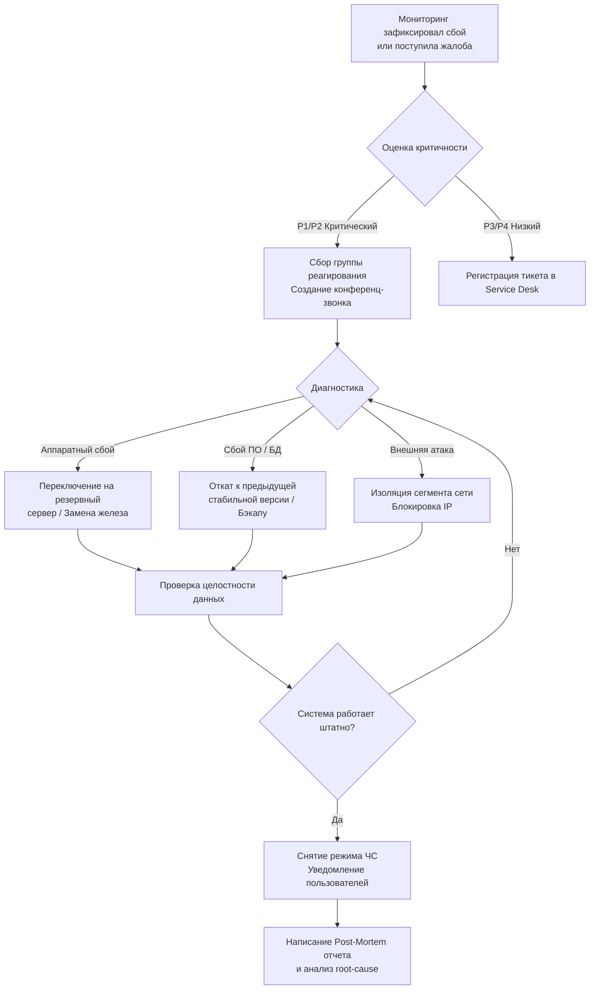

#### 9.4.1. Отказ сервера приложений
1. Определить причину отказа: проверить `systemctl status system` и `/var/log/system/error.log`.
2. При программном сбое (зависание процесса, утечка памяти) — выполнить `sudo systemctl restart system`.
3. Если перезапуск не помог — откатить последнюю версию кода или восстановить файлы из бэкапа.
4. При аппаратном отказе (недоступность хоста) — инициировать поднятие системы на резервном сервере.
#### 9.4.2. Отказ сервера баз данных
1. Проверить статус: `sudo systemctl status postgresql`.
2. Посмотреть логи СУБД: `sudo tail -f /var/log/postgresql/postgresql-14-main.log`.
3. Если база ушла в recovery mode или повреждены индексы — попытаться выполнить `REINDEX DATABASE system_db;`.
4. В случае физического повреждения файлов БД — развернуть последний валидный бэкап (см. п. 9.2.1).

### 9.5. Тестирование процедуры восстановления

*Зачем тестировать:* Тестирование переводит теоретический план восстановления в практический навык команды и выявляет скрытые проблемы (например, забытые пароли или нехватку места на тестовом стенде).

**Регламент тестирования:**
- **Еженедельно:** Автоматическая проверка контрольных сумм и структуры файлов бэкапов.
- **Ежемесячно:** Развертывание бэкапа БД на изолированный тестовый стенд и проверка целостности данных.
- **Ежеквартально:** Полное учение по Disaster Recovery (DR Drill) — симуляция полного отказа продуктивного сервера с замером фактического RTO.

```bash
#!/bin/bash
# Скрипт ежемесячного тестового восстановления /opt/system/scripts/test_restore.sh

TEST_DIR="/tmp/restore_test_$(date +%Y%m%d)"
LATEST_BACKUP=$(ls -t /backup/database/db_backup_*.dump.gz | head -1)

echo "Начало тестового восстановления из $LATEST_BACKUP..."
mkdir -p $TEST_DIR

# Попытка прочитать структуру архива
if pg_restore -l $LATEST_BACKUP > $TEST_DIR/structure.log 2>&1; then
    echo "[OK] Структура бэкапа валидна."
    
    # (Опционально) Развертывание на тестовую БД
    # createdb test_restore_db
    # pg_restore -d test_restore_db $LATEST_BACKUP
    
    echo "[OK] Тестовое восстановление завершено успешно."
else
    echo "[CRITICAL] Ошибка при чтении бэкапа! Требуется немедленная проверка системы резервного копирования."
    # Здесь можно добавить отправку алерта в Telegram/Email
fi

# Очистка временных файлов
rm -rf $TEST_DIR
```
## Приложение А. Журнал изменений

*Назначение приложения:* Журнал изменений обеспечивает отслеживание эволюции документа, позволяет определить актуальную версию и понять, какие разделы были добавлены или переработаны. Ведение журнала является обязательным требованием ГОСТ 2.503-2013 «Единая система конструкторской документации. Правила внесения изменений».

*Таблица А.1 — История изменений документа*

| Версия | Дата | Описание изменений | Автор |
|--------|------|-------------------|-------|
| 1.0 | 12.09.2026 | Первоначальная версия. Базовая структура руководства по ГОСТ 19.505-79. | AviHID |
| 2.0 | 12.09.2026 | Расширенная версия. Добавлены: содержание; вводные абзацы (что/зачем/как) к каждому разделу; схемы Mermaid по тексту глав; расписание мониторинга ПО и АО; конкретные плейсхолдеры для [Название ИС] и [Название Организации]; обобщающие диаграммы архитектуры и жизненного цикла системы. | AviHID |
| | | | |

*Примечание:* При внесении изменений в документ необходимо обновлять номер версии согласно правилам: мажорная версия (X.0) — при значительной переработке структуры, минорная версия (X.Y) — при добавлении или изменении отдельных разделов.

---

## Приложение Б. Сводные схемы и диаграммы

*Назначение приложения:* Данное приложение содержит обобщающие диаграммы, иллюстрирующие архитектуру [Название ИС] и её жизненный цикл в целом. Эти схемы предназначены для быстрого ознакомления нового администратора с системой, а также для использования в презентациях и отчётах перед руководством [Название Организации].

### Б.1. Полная архитектура системы

*Рисунок Б.1 — Компонентная архитектура [Название ИС] с указанием всех взаимодействий*

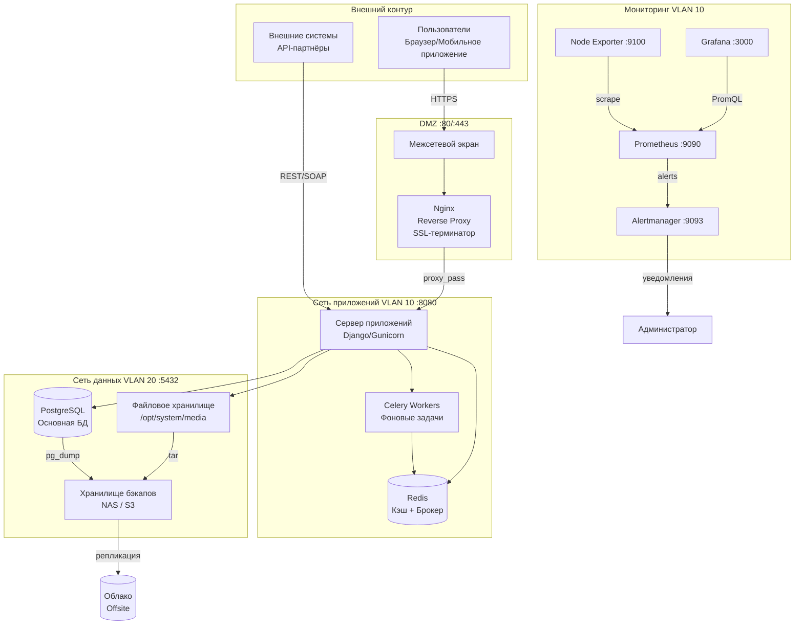

### Б.2. Жизненный цикл системы

*Рисунок Б.2 — Полный жизненный цикл [Название ИС] от развёртывания до вывода из эксплуатации*

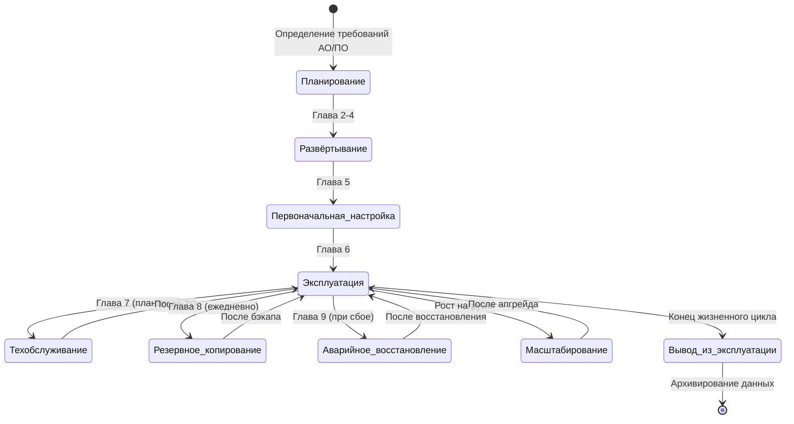

### Б.3. Потоки данных и мониторинга

*Рисунок Б.3 — Обобщённая диаграмма потоков данных, метрик и алертов в системе*
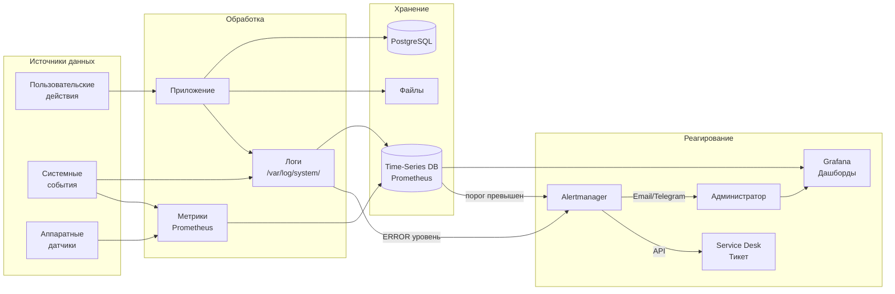

### Б.4. Матрица ответственности (RACI)

*Таблица Б.1 — Матрица ответственности за процессы администрирования*

| Процесс | Администратор ИС | Инженер АО | Разработчик | Руководитель IT |
|---------|:---:|:---:|:---:|:---:|
| Развёртывание системы | **R/A** | C | C | I |
| Настройка ролей | **R/A** | - | C | I |
| Плановое ТО оборудования | C | **R/A** | - | I |
| Обновление ПО | **R/A** | I | C | I |
| Резервное копирование | **R/A** | C | - | I |
| Аварийное восстановление (P1) | **R/A** | C | C | **A** |
| Аудит безопасности | **R** | I | C | **A** |
| Тестирование DR-процедур | **R** | C | I | **A** |

*Условные обозначения:*
- **R** (Responsible) — исполняет работу
- **A** (Accountable) — несёт ответственность, утверждает результат
- **C** (Consulted) — консультирует, предоставляет экспертизу
- **I** (Informed) — информируется о результате

---

**Конец документа**

---

*Документ подготовлен в соответствии с требованиями:*
- *ГОСТ 2.105-95 «Единая система конструкторской документации. Общие требования к текстовым документам»*
- *ГОСТ 19.505-79 «Руководство администратора. Требования к содержанию и оформлению»*
- *ГОСТ 2.503-2013 «Правила внесения изменений»*

*© 2026 [Название Организации]. Все права защищены.*
